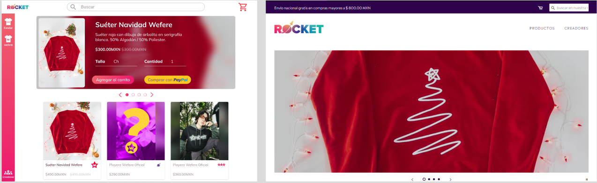
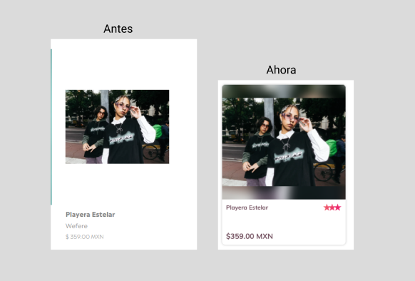
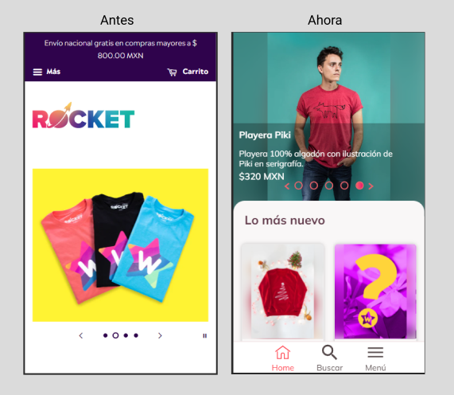
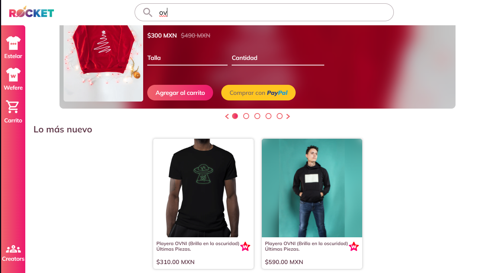
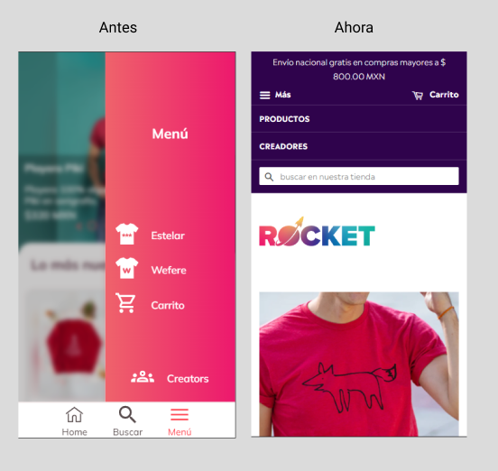
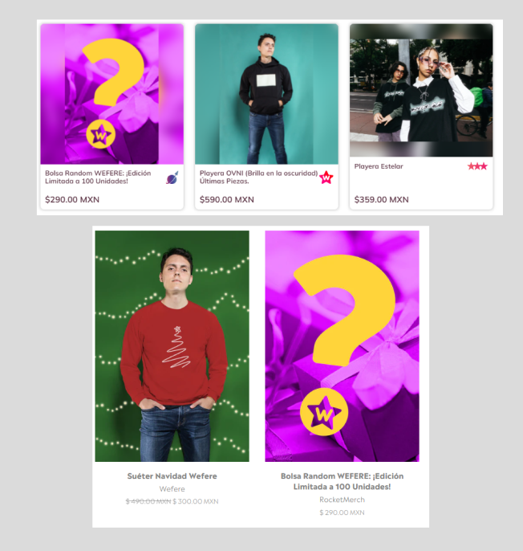

# RocketMerch diseño alternativo 

Este código busca mostrar mis habilidades cómo diseñador y desarrollador web, para ello propuse un diseño alternativo al sitio rocketMerch de Wafere, el cual se encuentra en https://wefere.com y también en https://rocketmerch.store 

## Objetivos del diseño 
  [1. Actualizar el diseño a uno moderno](#diseño-moderno)   
  [2. Hacerlo adaptable a diferentes    dispositivos](#diseño-adaptable)   
  [3. Mejorar el buscador](#buscador)    
  [4. Mejorar la experiencia de usuario](#eperiencia-de-usuario-ux)
  [5. Que el diseño mobile sea cómodo, todo al alcance del pulgar el cual se basa en la ley de Fitts ]()

> Ley de fitts https://es.wikipedia.org/wiki/Ley_de_Fitts 

## Diseño moderno

  1. Se propone cambiar la navegación a una más simple y fácil de usar, el buscador filtrará resultados por categorías, nombres, y descripciones, así se llega más rapido a lo que quieres buscar. ¿Quieres una playera? Escribelo en el buscador. 
  Este funciona de manera inmediata mientras escribes, olvidate de tener que recargar el sitio para encontrar lo que buscas. 

  2. Quizá quieres una playera de Wefere, o quizá de su marca Estelar o algo en especificó de la RocketMerch? solo seleccióna a la izquierda y así de fácil encontrarás lo que quieres. En ese menú lateral se podría también colocar en lugar de creadores los tipos de merch, sea playera, suéter o sudadera. 

  3. El carousel ahora te permite comprar desde allí mismo, además de darte más información sobre lo que vas a comprar, tener animaciones de deslizamiento y ser infinito, ya no solo verás una imagen, ahora es mucho más que eso.

  4. El texto centrado se considera una mala práctica de diseño, pues a tu cerebro le cuesta más volver a encontrar donde inicia la siguiente linea, por ello se cambió el foromato por uno alineado a la izquierda 

  5. Los productos en el diseño anterior no daban claridad al usuario de donde terminaba y donde iniciabla cada tarjeta, no había un contraste de color ni nada que permitiera tener esta información, por lo que se decidió agregar una sombra a cada tarjeta y un efecto en la misma al pasar el cursor. Esto con el fin de tener una experiencia más agradable y hacer más atractivo el diseño.

  6. Las imagenes más cuadradas dejaban un gran espacio en blanco y una sensación algo extraña al mirar, este problema fue solucionado al agragar un fondo estirado con un filtro de blur.
   

## Diseño adaptable
El diseño se adapta automaticamente a dispositivos más pequeños para no perder experiencia al navegar, es importante recordar que la mayoría de los usuarios acceden al sitio atravez de sus dispositivos moviles.

## Buscador 

El buscador no necesita recargar el sitio y funciona a medida que escribes, puedes ver como el contenido del sitio va cambiando cuando estás buscando.

## Experiencia de usuario (UX)
Todo lo anterior junto con el diseño Fitts mejorán la experiencia del usuario al navegar por la tienda, le permite encontrar más fácil lo que busca, tener un diseño más agradable a la vista, navegar cómodamente en su dispositivo movil, tener transiciones más atractivas y suaves además de ser más accesible.

## Diseño al Fitts
El menú, los botones y absolutamente todo está hecho para ser cómodo, práctico y fácil de usar, la barra de busqueda se despliega y abre el teclado al tocar en el icono de la busqueda, las opciones están cerda de la parte inferior derecha del dispositivo, los productos y absolutamente todo está al alcance del pulgar, no tienes que usar la otra mano ni mover tu dispositivo movil de un lado al otro, todo está optimizado para un uso prático y sencillo. Tienes lo que necesitas al alcance de tu dedo y en escritorio lo tienes todo a la vista, sin complicarte para llegar a donde deseas. Una excelente experiencia de usuario acompañada de un buen diseño de interfaz puede enamorar a cualquier usuario.

Nota: Se me hizo atractivo cambiar los nombres wefere, RocketMerch y Estelar por los logos de cada uno.

